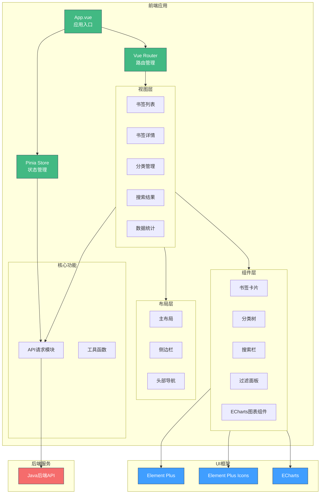

# test-BookMarkAnalysisVue3

书签管理项目前台应用 - Vue3 + Vite

## 技术栈

| 技术 | 版本 |
|------|------|
| Vue | ^3.5.31 |
| Vite | ^8.0.3 |
| Pinia | ^3.0.4 |
| Vue Router | ^4.6.4 |
| Element Plus | ^2.13.6 |
| ECharts | ^6.0.0 |
| Axios | ^1.14.0 |
| TypeScript | ~6.0.2 |

## 项目结构

```
src/
├── App.vue              # 应用入口
├── main.ts              # 启动文件
├── router/              # 路由配置
├── stores/              # Pinia 状态管理
├── views/                # 页面视图
│   ├── dashboard/       # 数据统计面板
│   ├── tree/            # 分类树
│   ├── list/           # 书签列表
│   ├── manager/        # 管理页面
│   └── toolbox/        # 工具箱
├── components/          # 公共组件
├── layout/              # 布局组件
├── utils/               # 工具函数
└── assets/              # 静态资源
```

## 功能特性

- [x] 书签列表展示与管理
- [x] 分类树导航
- [x] 搜索与过滤
- [x] ECharts 数据可视化
- [x] 响应式布局（侧边栏 + 头部导航）

## 开发

```bash
# 安装依赖
npm install

# 启动开发服务器
npm run dev

# 构建生产版本
npm run build

# 预览构建结果
npm run preview
```

## 系统架构



## License

Private Project