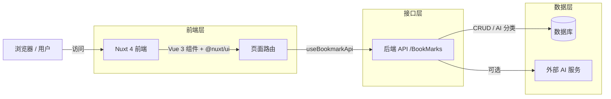

# 书签分析管理系统

## 项目简介

**书签分析管理系统** 是一个基于 Nuxt 4 + Vue 3 构建的浏览器书签分析与管理前端应用。它帮助用户导入、整理、检索和分析大量浏览器书签，提供仪表盘统计、文件夹树状浏览、全量数据检索、高级资源管理以及 AI 分类等能力。

主要功能包括：

- **仪表盘**：展示总书签数、文件夹数、标签数及最近添加数量。
- **导入书签**：支持从 Chrome / Firefox / Edge 导出的 HTML 文件批量导入。
- **高级资源管理器**：以表格形式管理书签，支持搜索、分页、编辑、删除及 AI 自动分类。
- **树状文件夹浏览**：按文件夹层级可视化展示书签结构。
- **全量数据检索**：按关键词搜索书签，支持多种排序方式。
- **管家工具箱**：提供批量标签管理、失效链接检测、数据导出、重复检测、标签合并、数据清理等工具入口。

## 系统架构图



## 技术栈

- **框架**：Nuxt 4.4.8
- **UI 框架**：Vue 3 + Vue Router
- **组件库**：@nuxt/ui v4
- **语言**：TypeScript
- **样式**：原生 CSS + MiniMax 设计系统变量
- **图标**：@iconify-json/ph（Phosphor Icons，以 `i-ph-` 为前缀）
- **包管理器**：pnpm
- **协议**：AGPL-3.0

## 项目结构

```text
test-BookMarkAnalysisVue3/
├── app.vue                 # 应用根组件
├── nuxt.config.ts          # Nuxt 配置文件
├── package.json            # 依赖与脚本
├── tsconfig.app.json       # TypeScript 应用配置
├── tsconfig.node.json      # TypeScript Node 配置
├── design.md               # MiniMax 设计系统文档
├── LICENSE                 # AGPL-3.0 许可证
├── assets/
│   └── css/
│       └── main.css        # 全局样式与设计令牌
├── composables/
│   └── useBookmarkApi.ts   # 书签相关 API 封装
├── layouts/
│   └── default.vue         # 默认布局（导航栏 + 页脚）
└── pages/
    ├── index.vue           # 首页重定向到仪表盘
    ├── dashboard.vue       # 仪表盘统计页
    ├── import.vue          # 书签导入页
    ├── manager.vue         # 高级资源管理器
    ├── toolbox.vue         # 管家工具箱
    ├── tree.vue            # 树状文件夹浏览
    └── list.vue            # 全量数据检索
```

## API 说明

前端通过 `composables/useBookmarkApi.ts` 与后端通信。

- **API 基础路径**：后端控制器根路径为 `/BookMarks`，**没有 `/api` 前缀**。对接本后端时，建议将 `useBookmarkApi.ts` 中的 `baseURL` 设为空字符串 `''` 或直接以 `/BookMarks` 开头。
- **本地后端地址**：`http://localhost:8000`
- **Docker 后端地址**：`http://localhost:8080`

### 前端实际调用的后端接口

| 页面/功能 | 方法 | 接口路径 | 说明 |
|----------|------|----------|------|
| 仪表盘 | GET | `/BookMarks/stats` | 获取总书签数、文件夹数、标签数、最近添加数 |
| 资源管理器 | GET | `/BookMarks/list` | 分页获取书签列表 |
| 全量数据检索 | GET | `/BookMarks/search?keyword=&page=&limit=` | 按关键词搜索书签 |
| 树状文件夹 | GET | `/BookMarks/all` | 获取全部书签（用于构建树） |
| 导入书签 | POST | `/BookMarks/upload/auto` | 自动识别格式上传书签文件 |
| AI 分类 | POST | `/BookMarks/toolbox/ai/categorize` | 对选中的书签进行 AI 分类 |

> 注意：`useBookmarkApi.ts` 默认 `baseURL = ''`，所有接口路径均以 `/BookMarks/*` 开头，与上表约定一致。如需代理或跨域，可通过 `NUXT_PUBLIC_BASE_URL` 环境变量覆盖 `baseURL`。

## 启动方式

### 环境要求

- Node.js 18+
- pnpm（推荐）

### 安装依赖

```bash
pnpm install
```

### 启动开发服务器

```bash
pnpm dev
```

默认开发服务器地址为 `http://localhost:3000`。

### 构建生产版本

```bash
pnpm build
```

### 本地预览生产构建

```bash
pnpm preview
```

> 注意：本项目为前端工程，运行时需要配合后端 `/BookMarks` 服务提供数据接口。

## 图标说明

项目使用 `@nuxt/ui` 的 `UIcon` 组件加载 **Phosphor Icons** 图标集（`@iconify-json/ph`）。图标名称以 `i-ph-` 前缀开头，例如 `i-ph-bookmark`、`i-ph-folder`、`i-ph-magnifying-glass`。

## 开源协议

本项目采用 [AGPL-3.0](LICENSE) 开源协议。
