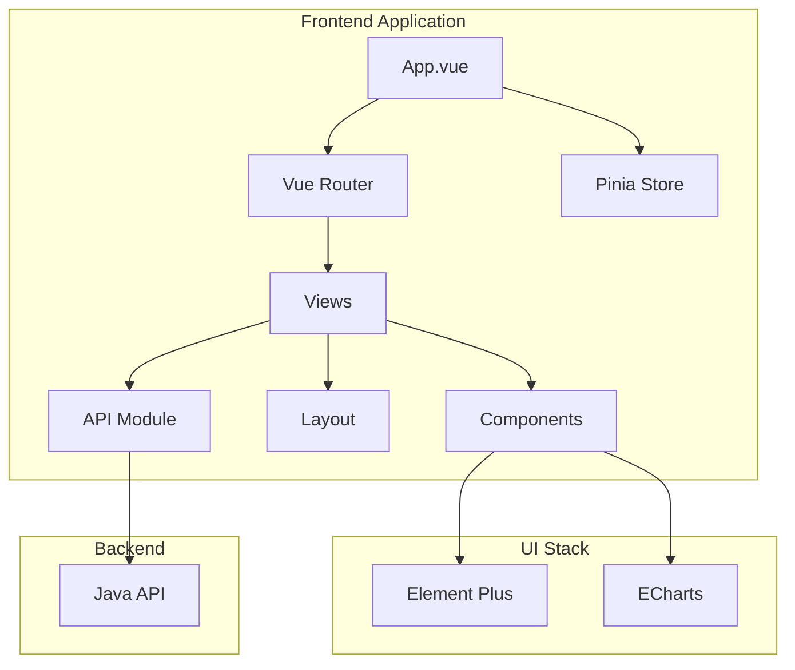

# test-BookMarkAnalysisVue3 Specification

## 1. Project Overview

- **Name**: test-BookMarkAnalysisVue3
- **Type**: Front-end Vue3 application (bookmark management)
- **Core Function**: A bookmark management system frontend for organizing, searching, and analyzing bookmarks
- **Target Users**: End users managing personal bookmark collections

## 2. Technical Stack

| Category | Technology | Version |
|----------|------------|---------|
| Framework | Vue | ^3.5.31 |
| Build Tool | Vite | ^8.0.3 |
| State Management | Pinia | ^3.0.4 |
| Router | Vue Router | ^4.6.4 |
| UI Framework | Element Plus | ^2.13.6 |
| Icons | @element-plus/icons-vue | ^2.3.2 |
| Charts | ECharts | ^6.0.0 |
| HTTP Client | Axios | ^1.14.0 |
| Language | TypeScript | ~6.0.2 |

## 3. Project Structure

```
src/
├── App.vue           # Application entry
├── main.ts           # Bootstrap file
├── router/           # Vue Router configuration
├── stores/           # Pinia stores
├── views/            # Page components
│   ├── dashboard/    # Dashboard view
│   ├── tree/        # Category tree view
│   ├── list/        # Bookmark list view
│   ├── manager/     # Manager view
│   └── toolbox/     # Toolbox view
├── components/       # Reusable components
├── layout/           # Layout components
├── utils/            # Utility functions
└── assets/           # Static assets
```

## 4. Features

- [x] Bookmark list display and management
- [x] Category tree navigation
- [x] Search and filtering
- [x] Data statistics with ECharts
- [x] Responsive layout with sidebar/header

## 5. Architecture



## 6. Scripts

| Command | Description |
|---------|-------------|
| `npm run dev` | Start development server |
| `npm run build` | Build for production |
| `npm run preview` | Preview production build |

## 7. Git Ignore

- `node_modules/` — npm dependencies
- `.DS_Store` — macOS system files
- `dist/` — build output
- `*.local` — local environment files

## 8. Status

- Git Status: Clean
- Build: Passing
- Dependencies: Up-to-date